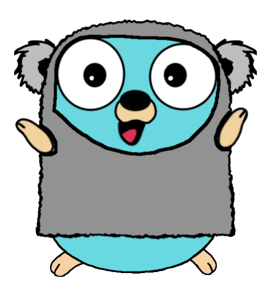

<p align="center">

</p>

# GoKoala

_Cloud Native OGC APIs server, written in Go._

[](https://github.com/PDOK/gokoala/actions/workflows/build-and-publish-image.yml)
[](https://github.com/PDOK/gokoala/actions/workflows/lint-go.yml)
[](https://github.com/PDOK/gokoala/actions/workflows/lint-ts.yml)
[](https://goreportcard.com/report/github.com/PDOK/gokoala)
[](https://raw.githack.com/wiki/PDOK/gokoala/coverage.html)
[](https://github.com/PDOK/gokoala/blob/master/LICENSE)
[](https://hub.docker.com/r/pdok/gokoala)

## Description

This server implements modern [OGC APIs](https://ogcapi.ogc.org/) such as Common, Tiles, Styles, Features and GeoVolumes
in a cloud-native way. It contains a complete implementation of OGC API Features (part 1, 2 and 5). With respect to
OGC API Tiles, Styles, GeoVolumes the goal is to keep a narrow focus, meaning complex logic is delegated to other
implementations. For example, vector tile hosting may be delegated to a vector tile engine, 3D tile hosting 
to object storage, raster map hosting to a WMS server, etc.

This application is deliberately not multi-tenant, it exposes an OGC API for _one_ dataset. Want to host multiple
datasets? Spin up a separate instance/container.

## Features

- [OGC API Common](https://ogcapi.ogc.org/common/) serves landing page and conformance declaration. Also serves
  OpenAPI specification and interactive Swagger UI. Multilingual support available.
- [OGC API Features](https://ogcapi.ogc.org/features/) supports Part 1 (core), Part 2 (crs) and Part 5 (schema) of the spec.
  - Serves features as HTML, GeoJSON and JSON-FG
  - Support one or more GeoPackages as backing datastores. This can be local or [Cloud-Backed](https://sqlite.org/cloudsqlite/doc/trunk/www/index.wiki) GeoPackages.
  - No on-the-fly reprojections are applied, separate GeoPackages should be configured ahead-of-time in each projection.
  - Supports property (`/items?property=<value>`) and temporal filtering (`/items?datetime=<timestamp>`.
  - Implements cursor-based pagination in order to support browsing large datasets.
  - Offers the ability to serve features representing "map sheets", allowing users to download a certain
    geographic area in an arbitrary format like zip, gpkg, etc.
- [OGC API Tiles](https://ogcapi.ogc.org/tiles/) serves HTML, JSON and TileJSON metadata. Act as a proxy in front
  of a vector tiles server (like Trex, Tegola, Martin) or object storage of your choosing.
  Currently, three projections (RD, ETRS89 and WebMercator) are supported. Both dataset tiles and
  geodata tiles (= tiles per collection) are supported.
- [OGC API Styles](https://ogcapi.ogc.org/styles/) serves HTML (including legends)
  and JSON representation of supported (Mapbox) styles.
- [OGC API 3D GeoVolumes](https://ogcapi.ogc.org/geovolumes/) serves HTML and JSON metadata and functions as a proxy
  in front of a [3D Tiles](https://www.ogc.org/standard/3dtiles/) server/storage of your choosing.

## Build

```bash
docker build -t pdok/gokoala .
```

## Run

```bash
NAME:
   GoKoala - Cloud Native OGC APIs server, written in Go

USAGE:
   GoKoala [global options] command [command options] [arguments...]

COMMANDS:
   help, h  Shows a list of commands or help for one command

GLOBAL OPTIONS:
   --host value            bind host for OGC server (default: "0.0.0.0") [$HOST]
   --port value            bind port for OGC server (default: 8080) [$PORT]
   --debug-port value      bind port for debug server (disabled by default), do not expose this port publicly (default: -1) [$DEBUG_PORT]
   --shutdown-delay value  delay (in seconds) before initiating graceful shutdown (e.g. useful in k8s to allow ingress controller to update their endpoints list) (default: 0) [$SHUTDOWN_DELAY]
   --config-file value     reference to YAML configuration file [$CONFIG_FILE]
   --theme-file value      reference to a (customized) YAML configuration file for the theme [$THEME_FILE]
   --openapi-file value    reference to a (customized) OGC OpenAPI spec for the dynamic parts of your OGC API [$OPENAPI_FILE]
   --enable-trailing-slash allow API calls to URLs with a trailing slash. (default: false) [$ALLOW_TRAILING_SLASH]
   --enable-cors           enable Cross-Origin Resource Sharing (CORS) as required by OGC API specs. Disable if you handle CORS elsewhere. (default: false) [$ENABLE_CORS]
   --help, -h              show help
```

Example (config-file is mandatory):

```docker
docker run -v `pwd`/examples:/examples -p 8080:8080 -it pdok/gokoala --config-file /examples/config_vectortiles.yaml
```

Now open <http://localhost:8080>. See [examples](examples) for more details.

### Configuration file

The configuration file consists of a general section and a section
per OGC API building block (tiles, styles, etc). See [example configuration
files](examples/) for details. You can reference environment variables in the
configuration file. For example to use the `MY_SERVER` env var:

```yaml
ogcApi:
  tiles:
    title: My Dataset
    tileServer: https://${MY_SERVER}/foo/bar
```

### Custom theming

GoKoala offers some minimal theming options. When running GoKoala, pass an argument of `-theme-file` to load a custom
theming file. The [theme.yaml](./theme.yaml) in the root directory contains the configurable options for the theme.

For example:

- Create a directory e.g. `mytheme` and place a customized copy of `theme.yaml` and additional assets/images in this directory.
- Mount `mytheme`'` as a volume and start GoKoala with the custom theme:

```bash
docker run -v `pwd`/examples:/examples -v `pwd`/mytheme:/mytheme -p 8080:8080 -it pdok/gokoala \
 --config-file /examples/config_vectortiles.yaml --theme-file /mytheme/theme.yaml
```

### GeoPackage requirements

GoKoala has a few requirements regarding GeoPackages backing an OGC API Features:

- Each feature table must contain a [RTree](https://www.geopackage.org/guidance/extensions/rtree_spatial_indexes.html) index.
- Each feature table must contain a BTree spatial index:

```sql
select load_extension('/path/to/mod_spatialite');
alter table "<table>" add minx numeric;
alter table "<table>" add maxx numeric;
alter table "<table>" add miny numeric;
alter table "<table>" add maxy numeric;
update "<table>" set minx = st_minx('geom'), maxx = st_maxx('geom'), miny = st_miny('geom'), maxy = st_maxy('geom');
create index "<table>_spatial_idx" on "<table>"(fid, minx, maxx, miny, maxy);
```

- When enabling temporal filtering (using `datetime` query param) the temporal fields should be indexed and the spatial index should be expanded to include the temporal fields.

```sql
create index "<table>_spatial_idx" on "<table>"(fid, minx, maxx, miny, maxy, start_date, end_date);
create index "<table>_temporal_idx" on "<table>"(start_date, end_date);
```

- Each column used for property filtering should have an index, unless `indexRequired: false` is specified in the config.
- Feature IDs (fid) in the GeoPackage should be contiguous and auto-incrementing.

This is in addition to some of the requirements set forth by the PDOK [GeoPackage validator](https://github.com/PDOK/geopackage-validator).
Some of the requirements stated above can be automatically applied with help of the PDOK [GeoPackage optimizer](https://github.com/PDOK/geopackage-optimizer-go).

When using [Cloud-Backed](https://sqlite.org/cloudsqlite/doc/trunk/www/index.wiki) GeoPackages we recommend a local cache that is able to hold the spatial index, see `maxSize` in the config.

### OpenAPI spec

GoKoala ships with OGC OpenAPI support out of the box, see [OpenAPI
specs](engine/templates/openapi) for details. You can overwrite or extend
the defaults by providing your own spec using the `openapi-file` CLI flag.

### Observability

#### Health checks

Health endpoint is available on `/health`. When the server is configured to serve OGC API Tiles, the health endpoint will check for the presence of a specific tile on the configured tileserver.
When no OGC API Tiles are configured, the health endpoint will simply serve an HTTP 200 when called.

By default, when OGC API Tiles are configured, the checked tile is determined from a fixed lookup table, based on the deepest zoomlevel (i.e., `zoomLevelRange.end`) of `EPSG:28992` (e.g., if the
deepest zoomlevel is 12, the path of the checked tile is `/NetherlandsRDNewQuad/12/1462/2288.pbf`).  
It is possible to override the tile to be checked, both in terms of projection (SRS/CRS) and specific tile path:

```yaml
ogcApi:
  tiles:
    healthCheck:
      srs: EPSG:3035
      tilePath: /EuropeanETRS89_LAEAQuad/14/8237/7303
```

When specifying a projection other than `EPSG:28992`, the `tilePath` _must_ also be specified. When specifying a `tilePath`, the format to be used is either `/{tileMatrixSetId}/{tileMatrix}/{col}/{row}.pbf` or
`/{tileMatrixSetId}/{tileMatrix}/{row}/{col}.pbf` (depending on what order the tile server requires).

#### Profiling

Besides the main OGC server GoKoala can also start a debug server. This server
binds to localhost and a different port which you must specify using the
`--debug-port` flag. You shouldn't expose this port publicly but only access it
through a tunnel/port-forward. The debug server exposes `/debug` for use by
[pprof](https://go.dev/blog/pprof). For example with `--debug-port 9001`:

- Create a tunnel to the debug server e.g. in k8s: `kubectl port-forward
gokoala-75f59d57f4-4nd6q 9001:9001`
- Create CPU profile: `go tool pprof
http://localhost:9001/debug/pprof/profile?seconds=20`
- Start pprof visualization `go tool pprof -http=":8000" pprofbin <path to pb.gz
file>`
- Open <http://localhost:8000> to explore CPU flamegraphs and such.

A similar flow can be used to profile memory issues.

#### SQL query logging

Set `LOG_SQL=true` environment variable to enable logging of all SQL queries to stdout for debug purposes. 
Only applies to OGC API Features. Set e.g. `SLOW_QUERY_TIME=10s` to change the definition of a
slow query. Slow queries are always logged, unless they exceed the request timeout (which is currently 15s).

## Develop

Design principles:

- Performance and scalability are key!
- Be opinionated when you can, only make stuff configurable when you must.
- The `ogc` [package](internal/ogc/README.md) contains logic per specific OGC API
  building block.
- The `engine` package should contain general logic. `ogc` may reference
  `engine`.
  > :warning: The other way around is not allowed!
- Geospatial related configuration is done through the config file, technical
  configuration (host/port/etc) is done through CLI flags/env variables.
- Fail fast, fail hard: do as much pre-processing/validation on startup instead
  of during request handling.
- Assets/templates/etc should be explicitly included in the Docker image, see COPY
  commands in [Dockerfile](Dockerfile).

### Build/run as Go application

Make sure [SpatiaLite](https://www.gaia-gis.it/fossil/libspatialite/index), [PROJ](https://proj.org/en/stable/install.html), `openssl` and `curl` are installed.
Also make sure `gcc` or similar is available since the application uses cgo.

```bash
go build -o gokoala cmd/main.go
./gokoala
```

To troubleshoot, review the [Dockerfile](./Dockerfile) since compilation also happens there.
Optionally set `SPATIALITE_LIBRARY_PATH=/path/to/spatialite` when SpatiaLite isn't found.

### Linting

Install [golangci-lint](https://golangci-lint.run/usage/install/) and run `golangci-lint run`
from the root.

### Viewer

GoKoala includes a [viewer](viewer) which is available
as a [Web Component](https://developer.mozilla.org/en-US/docs/Web/API/Web_components) for embedding in HTML pages. 
To use the viewer locally when running GoKoala outside Docker execute: `hack/build-local-viewer.sh`. This will 
build the viewer and add it to the GoKoala assets.

Note this is only required for local development. When running GoKoala as a container this is
already being taken care of when building the Docker container image.

### IntelliJ / GoLand

- Install the [Go Template](https://plugins.jetbrains.com/plugin/10581-go-template) plugin
- Open `Preferences` > `Editor` > `File Types` select `Go Template files` and
  add the following file patterns:
  - `"*.go.html"`
  - `"*.go.json"`
  - `"*.go.tilejson"`
  - `"*.go.xml"`
- Now add template language support by running the
  [setup-jetbrains-gotemplates.sh](hack/setup-jetbrains-gotemplates.sh) script.
- Reopen the project (or restart IDE). Now you'll have full IDE support in the GoKoala templates.

Also:

- Set import order in `Preferences` > `Editor` > `Code Style` > `Go` > `Imports`
  to `goimports` to align with VSCode and goimports usage in golangci-lint.

### VSCode

- Install the [Go Template](https://marketplace.visualstudio.com/items?itemName=jinliming2.vscode-go-template)
  extension
- Open Extension Settings and add the following file patterns:
  - `"*.go.html"`
  - `"*.go.json"`
  - `"*.go.tilejson"`
  - `"*.go.xml"`
- Also add `html`, `json` and `xml` to the list of Go template languages.
- Now you'll have IDE support in the GoKoala templates.

### OGC compliance validation

See our [end-to-end tests](tests/README.md) for details.

## Misc

### How to Contribute

Make a pull request...

### Contact

Contacting the maintainers can be done through the issue tracker.
